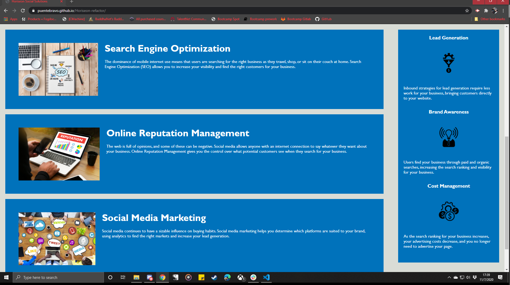

# Horiseon-refactor

This code has been refactored as requested by the client, Horiseon Social Solutions, Inc, for the purpose of accessibility, ease of use, and compliance with WCAG 2.1. Further improvements were made to increase the long term stability of the code base.

Changelog:

- Alt tags added to images to comply with WCAG 2.1
- Fixed link leading to search engine optimization article; link should now path to correct section
- Re-configured Article images to float left for accessibility
- Added semantic HTML tags for clarity and accessibility
- Consolidated CSS selectors with identical values
- Re-ordered CSS to align with HTML formatting

Screenshots:

Link to deployed site:

[Deployed Site](https://puentebravo.github.io/Horiseon-refactor/)

---

Copyright (c) [2020] [Charlie Puente]
